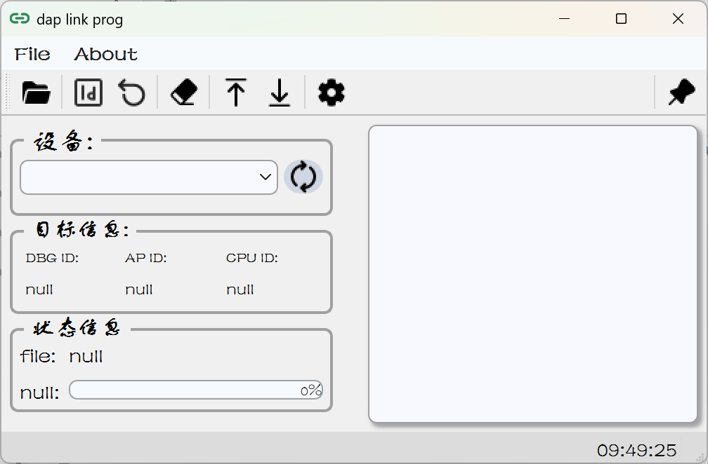
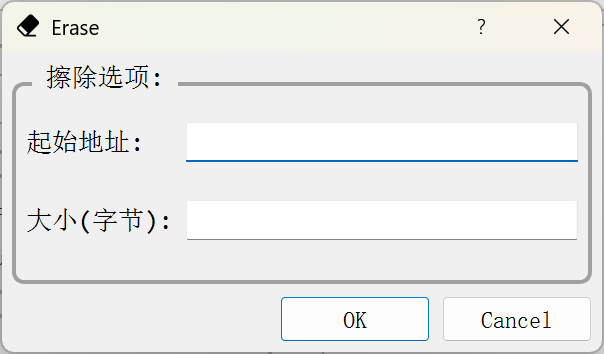
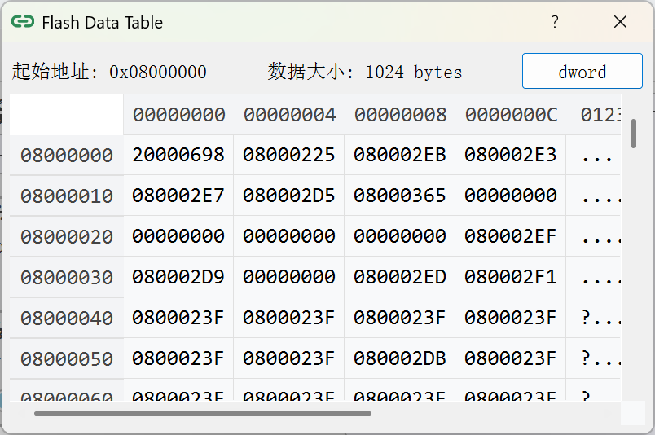
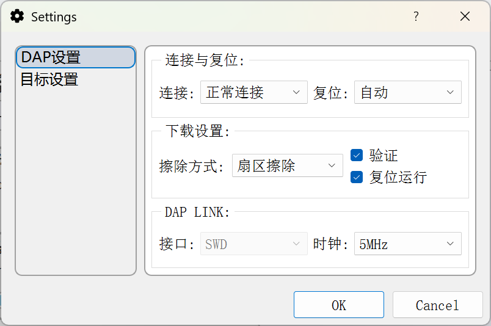
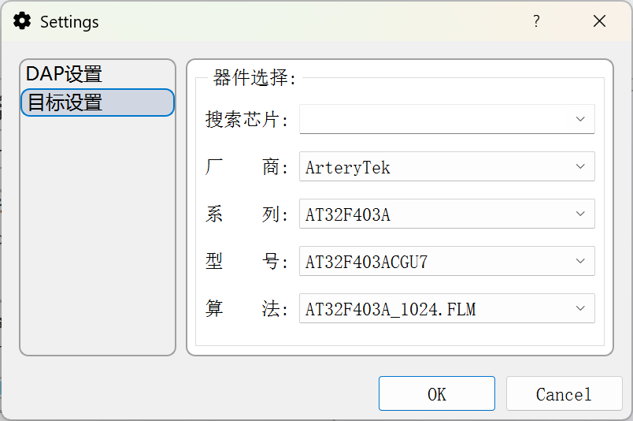

# dap link prog

作者：Ze-Hou
邮箱：2179603549@qq.com

## 概述
　　演示视频 [dap link prog](https://www.bilibili.com/video/BV1cS4UztE3C/)

　　一款dap上位机，目前支持dap上位机的基础功能

　　核心处理部分直接使用arm的dap协议通过USB发送原始数据包，**未使用如pyocd进行包装**

## 使用方法
　　获取源码后使用`environment.yml`安装好虚拟环境，然后在项目根目录执行`python build.py`可打包出软件，前提是需要安装好打包工具。